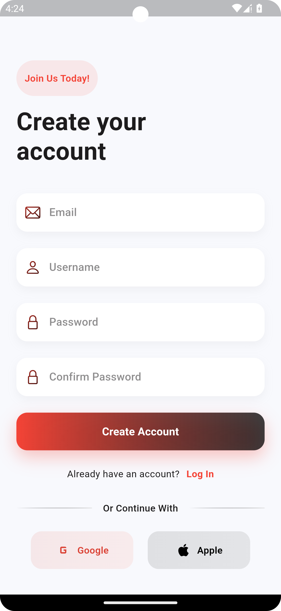
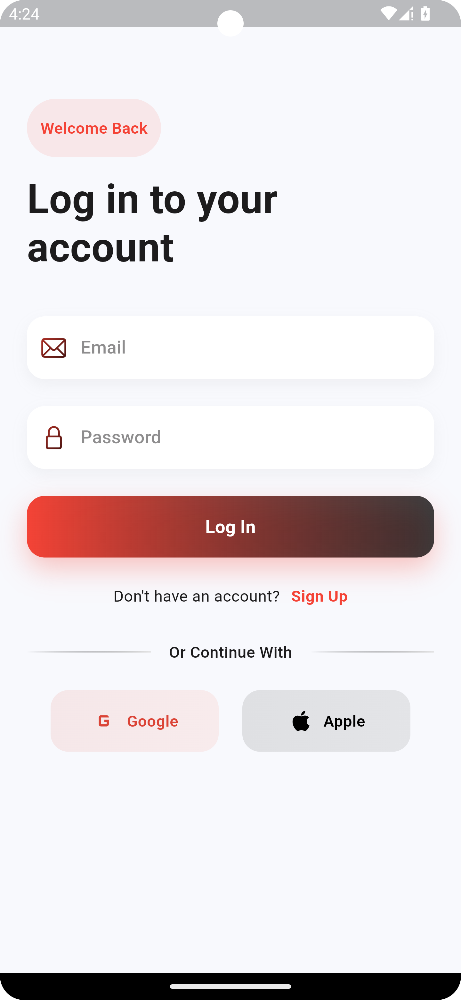
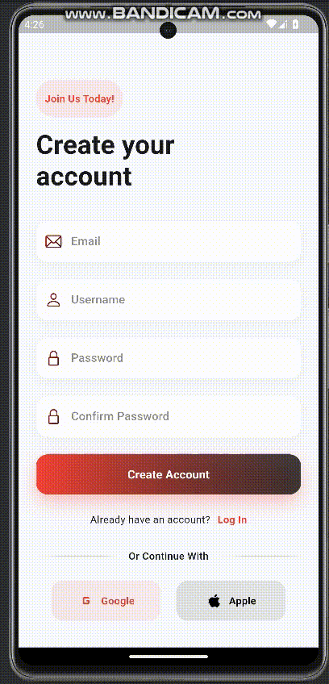

# Animated Signup and Login Page

This project demonstrates an **animated Signup and Login page** using Flutter. The app incorporates animations, custom UI components, and linear gradients to provide a visually appealing and interactive user experience.

---

## Features

- **Custom Signup and Login Pages**: Designed with clean and modern UI.
- **Smooth Animations**: Using the `animate_do` package for fade-in and elastic effects.
- **Custom Widgets**: Includes reusable custom buttons and text fields.
- **Linear Gradients**: For stylish backgrounds and buttons.
- **Social Media Login Options**: Integrated placeholders for Google and Apple login.

---

## Screenshots

| Signup Page                     | Login Page                     |
|----------------------------------|---------------------------------|
|  |  |

---

## Demo

Watch the demo video below:




---

## Dependencies

Add the following dependencies to your `pubspec.yaml` file:

```yaml
dependencies:
  flutter:
    sdk: flutter
  animate_do: ^2.1.0
```

---

## File Structure

```plaintext
lib/
├── screens/
│   ├── signup_screen.dart    # Signup page implementation
│   ├── login_screen.dart     # Login page implementation
├── widgets/
│   ├── custom_button.dart    # Reusable button widget
│   ├── custom_field.dart     # Reusable text field widget
assets/
├── loginscreen.png            # Login screen screenshot
├── signupscreen.png           # Signup screen screenshot
├── startscreen.mp4            # Demo video
```

---

## How It Works

### **Signup Screen**

- **Header**: Includes an introductory message with animations (`FadeInDown`).
- **Fields**: 
  - Email
  - Username
  - Password and Confirm Password
  - Each field uses linear gradient outlines and icons.
- **Animations**: Fields and buttons appear with `FadeInUp` effects.
- **Social Media Login**: Buttons for Google and Apple with gradient styling.

### **Login Screen**

- **Header**: Welcomes the user with animations (`FadeInDown`).
- **Fields**:
  - Email
  - Password
- **Animations**: Fields and buttons appear with `FadeInUp` effects.
- **Social Media Login**: Similar to the signup screen.

---

## How to Use

1. Clone the repository.
2. Add the required dependencies in your `pubspec.yaml`.
3. Run the application using:
   ```bash
   flutter run
   ```

---

## Code Highlights

### Example of Animated Header

```dart
FadeInDown(
  duration: Duration(milliseconds: 500),
  child: Text(
    "Welcome Back",
    style: TextStyle(
      color: Colors.red,
      fontWeight: FontWeight.w600,
    ),
  ),
),
```

### Custom Button Implementation

```dart
class CustomButton extends StatelessWidget {
  final VoidCallback onPressed;
  final String text;

  const CustomButton({
    Key? key,
    required this.onPressed,
    required this.text,
  }) : super(key: key);

  @override
  Widget build(BuildContext context) {
    return ElevatedButton(
      onPressed: onPressed,
      child: Text(text),
    );
  }
}
```

---

## Future Enhancements

- Add backend integration for user authentication.
- Include additional social media login options.
- Add validation for input fields.
- Enhance animations for a smoother experience.

---

## 🤝 Contributing

We welcome contributions! Feel free to submit a **pull request** or open an issue to discuss potential improvements.

---

## 🛡️ License

This project is licensed under the **MIT License** – see the [LICENSE](LICENSE) file for details.

---

## 📬 Contact

For any questions or suggestions, feel free to reach out:

- **GitHub**: [obaidullah72](https://github.com/obaidullah72)
- **LinkedIn**: [obaidullah72](https://www.linkedin.com/in/obaidullah72/)

---

[](https://visitcount.itsvg.in)
